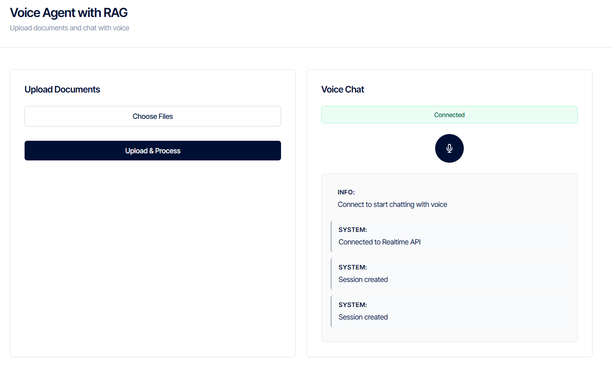

<div align="center">



# Voice AI Agent with RAG

**A production-ready FastAPI backend that combines OpenAI's Realtime API with Retrieval-Augmented Generation (RAG) for intelligent voice conversations powered by your documents.**

[](https://www.python.org/)
[](https://fastapi.tiangolo.com/)
[](LICENSE)

[Features](#-features) • [Quick Start](#-quick-start) • [Documentation](#-documentation) • [API Reference](#-api-reference)

</div>

---

## ✨ Features

### 🎤 Real-Time Voice Conversations
- **OpenAI Realtime API Integration**: Seamless voice-to-voice conversations with low latency
- **WebSocket Support**: Real-time bidirectional communication for instant responses
- **Server-Side VAD**: Automatic voice activity detection for natural conversation flow
- **Audio Streaming**: Efficient audio processing with 24kHz sample rate

### 📚 Retrieval-Augmented Generation (RAG)
- **Document Upload**: Support for PDF, TXT, MD, DOC, and DOCX files
- **Intelligent Chunking**: Smart text segmentation with configurable overlap
- **Vector Search**: Semantic search using Qdrant vector database
- **Reranking**: Enhanced retrieval quality with Cohere reranking API
- **Context Injection**: Automatic context injection into conversations

### 🎨 Modern Web Interface
- **Sleek SaaS Design**: Minimal, professional UI inspired by OpenAI and ElevenLabs
- **Real-Time Transcripts**: Live transcription of both user and assistant messages
- **Connection Status**: Visual indicators for WebSocket connection state
- **Responsive Layout**: Works seamlessly on desktop and mobile devices

### ⚡ Production Ready
- **FastAPI Framework**: High-performance async API framework
- **Comprehensive Logging**: Detailed logging for debugging and monitoring
- **Error Handling**: Robust error handling with graceful degradation
- **CORS Support**: Configurable CORS for frontend integration

---

## 🚀 Quick Start

### Prerequisites

- Python 3.11 or higher
- OpenAI API key
- (Optional) Cohere API key for reranking
- (Optional) Qdrant instance (local or cloud)

### Installation

1. **Clone the repository**
   ```bash
   git clone https://github.com/yourusername/ai-agent-realtimeapi-rag-backend.git
   cd ai-agent-realtimeapi-rag-backend
   ```

2. **Create a virtual environment**
   ```bash
   python -m venv venv
   source venv/bin/activate  # On Windows: venv\Scripts\activate
   ```

3. **Install dependencies**
   ```bash
   pip install -r requirements.txt
   ```

4. **Set up environment variables**
   
   Create a `.env` file in the root directory:
   ```env
   # Required
   OPENAI_API_KEY=your_openai_api_key_here
   
   # Optional - for reranking
   COHERE_API_KEY=your_cohere_api_key_here
   
   # Optional - Qdrant configuration
   QDRANT_URL=http://localhost:6333
   QDRANT_API_KEY=your_qdrant_api_key_here  # Only needed for cloud Qdrant
   QDRANT_COLLECTION_NAME=documents
   
   # Optional - RAG configuration
   ENABLE_RAG=true  # Set to "true" to enable RAG features
   REALTIME_SYSTEM_INSTRUCTIONS=You are a helpful assistant.
   LOG_LEVEL=INFO  # DEBUG, INFO, WARNING, ERROR
   ```

5. **Start Qdrant** (if using local instance)
   ```bash
   docker run -p 6333:6333 qdrant/qdrant
   ```

6. **Run the application**
   ```bash
   python main.py
   ```
   
   Or with uvicorn for development:
   ```bash
   uvicorn main:app --reload --host 0.0.0.0 --port 8000
   ```

7. **Access the web interface**
   
   Open your browser and navigate to:
   ```
   http://localhost:8000
   ```

---

## 📖 Documentation

### Project Structure

```
ai-agent-realtimeapi-rag-backend/
├── main.py                      # FastAPI application entry point
├── routes/
│   ├── __init__.py
│   └── upload.py                # File upload endpoint
├── services/
│   ├── __init__.py
│   ├── embeddings.py            # OpenAI embeddings generation
│   ├── vectorstore.py           # Qdrant vector database operations
│   ├── reranker.py              # Cohere reranking service
│   └── realtime_websocket.py    # OpenAI Realtime API WebSocket handler
├── utils/
│   ├── __init__.py
│   └── chunking.py              # Text chunking utilities
├── static/
│   ├── index.html               # Web interface
│   └── Cover_voce_ai_agent.png  # Project cover image
├── Example/
│   ├── audio_util.py            # Audio processing utilities
│   └── push_to_talk_app.py      # Example push-to-talk implementation
├── requirements.txt             # Python dependencies
└── README.md                    # This file
```

### How It Works

1. **Document Processing**
   - Users upload documents through the web interface or API
   - Documents are parsed and chunked into manageable pieces
   - Embeddings are generated using OpenAI's `text-embedding-3-small` model
   - Chunks are stored in Qdrant vector database

2. **Voice Conversation**
   - User connects via WebSocket to `/ws/realtime`
   - Audio is streamed in real-time to OpenAI Realtime API
   - Server-side VAD detects when user stops speaking
   - If RAG is enabled, user transcript triggers document search
   - Relevant context is injected before generating response
   - Assistant response is streamed back as audio and text

3. **RAG Enhancement**
   - When RAG is enabled, user queries trigger semantic search
   - Top-k documents are retrieved from Qdrant
   - Optional Cohere reranking improves relevance
   - Context is injected as system messages in the conversation

---

## 📡 API Reference

### REST Endpoints

#### `GET /`
Returns the web interface HTML page.

#### `GET /health`
Health check endpoint.

**Response:**
```json
{
  "status": "healthy"
}
```

#### `POST /upload`
Upload and process documents for RAG.

**Request:**
- Method: `POST`
- Content-Type: `multipart/form-data`
- Body: `file` field with document file(s)

**Response:**
```json
{
  "message": "File uploaded and processed successfully",
  "filename": "example.pdf",
  "chunks_processed": 15,
  "document_ids": ["uuid1", "uuid2", "..."]
}
```

**Example:**
```bash
curl -X POST "http://localhost:8000/upload" \
  -F "file=@document.pdf"
```

### WebSocket Endpoints

#### `WS /ws/realtime`
Real-time voice conversation endpoint using OpenAI Realtime API.

**Connection:**
```javascript
const ws = new WebSocket('ws://localhost:8000/ws/realtime');
```

**Message Format:**
The WebSocket follows the [OpenAI Realtime API protocol](https://platform.openai.com/docs/guides/realtime). Common message types:

- `input_audio_buffer.append`: Send audio chunks
- `input_audio_buffer.commit`: Commit audio buffer
- `response.create`: Create a response
- `conversation.item.create`: Create conversation items

**Event Types:**
- `conversation.item.input_audio_transcription.delta`: Real-time user transcript
- `conversation.item.input_audio_transcription.completed`: Completed user transcript
- `response.output_audio.delta`: Assistant audio chunks
- `response.output_audio_transcript.delta`: Assistant transcript chunks
- `response.output_text.delta`: Assistant text chunks

**Example Usage:**
See the web interface at `http://localhost:8000` for a complete implementation.

---

## ⚙️ Configuration

### Environment Variables

| Variable | Required | Default | Description |
|----------|----------|---------|-------------|
| `OPENAI_API_KEY` | Yes | - | Your OpenAI API key |
| `COHERE_API_KEY` | No | - | Cohere API key for reranking |
| `QDRANT_URL` | No | `http://localhost:6333` | Qdrant server URL |
| `QDRANT_API_KEY` | No | - | Qdrant API key (for cloud) |
| `QDRANT_COLLECTION_NAME` | No | `documents` | Qdrant collection name |
| `ENABLE_RAG` | No | `false` | Enable RAG features (`true`/`false`) |
| `REALTIME_SYSTEM_INSTRUCTIONS` | No | - | System instructions for the assistant |
| `LOG_LEVEL` | No | `INFO` | Logging level (`DEBUG`, `INFO`, `WARNING`, `ERROR`) |

### Model Configuration

- **Embedding Model**: `text-embedding-3-small` (OpenAI)
- **Reranking Model**: `rerank-english-v3.0` (Cohere)
- **Realtime Model**: `gpt-realtime` (OpenAI)
- **Transcription Model**: `gpt-4o-mini-transcribe` (OpenAI)

### Chunking Configuration

Default settings in `utils/chunking.py`:
- **Chunk Size**: 1000 characters
- **Chunk Overlap**: 200 characters

---

## 🎯 Use Cases

- **Document Q&A**: Ask questions about uploaded documents in natural voice
- **Knowledge Base Assistant**: Build a voice-enabled knowledge base
- **Customer Support**: Voice-powered support with document context
- **Educational Tools**: Interactive learning with document references
- **Research Assistant**: Voice queries across research papers and documents

---

## 🛠️ Development

### Running Tests

```bash
# Test RAG functionality
python test_rag.py

# Test Realtime API connection
python test_realtime_connection.py
```

### Code Structure

- **FastAPI**: Modern async web framework
- **OpenAI SDK**: Official Python SDK for OpenAI APIs
- **Qdrant Client**: Async Qdrant client for vector operations
- **Cohere SDK**: Cohere API client for reranking
- **WebSockets**: Native WebSocket support via FastAPI

---

## 🤝 Contributing

Contributions are welcome! Please feel free to submit a Pull Request.

1. Fork the repository
2. Create your feature branch (`git checkout -b feature/AmazingFeature`)
3. Commit your changes (`git commit -m 'Add some AmazingFeature'`)
4. Push to the branch (`git push origin feature/AmazingFeature`)
5. Open a Pull Request

---

## 📝 License

This project is licensed under the MIT License - see the [LICENSE](LICENSE) file for details.

---

## 🙏 Acknowledgments

- [OpenAI](https://openai.com/) for the Realtime API
- [Qdrant](https://qdrant.tech/) for the vector database
- [Cohere](https://cohere.com/) for reranking capabilities
- [FastAPI](https://fastapi.tiangolo.com/) for the excellent web framework

---

## 📧 Support

For issues, questions, or contributions, please open an issue on GitHub.

---

<div align="center">

**Built with ❤️ using OpenAI Realtime API and RAG**

[⭐ Star this repo](https://github.com/yourusername/ai-agent-realtimeapi-rag-backend) if you find it helpful!

</div>
